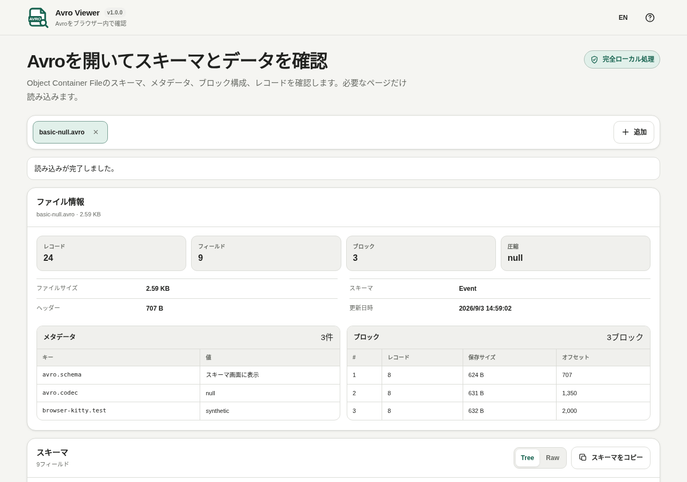

# Avro Viewer

[](https://github.com/ttomohisa/htmlapps-avro-viewer/actions/workflows/deploy-pages.yml)
[](LICENSE)
[](https://ttomohisa.github.io/htmlapps-avro-viewer/)

[English README](README.md)

Apache Avro Object Container Fileを外部へアップロードせず、スキーマ・メタデータ・ブロック構成・Logical Type・レコードをブラウザ内だけで確認できる単一HTMLビューアです。

## 🚀 デモ

### [GitHub PagesでAvro Viewerを開く](https://ttomohisa.github.io/htmlapps-avro-viewer/)

GitHub Pagesから最初のHTMLを読み込んだ後、選択したファイルは端末内で読み込み・処理されます。アプリからファイル内容を外部サーバーへアップロードしません。

[](https://ttomohisa.github.io/htmlapps-avro-viewer/)

## 主な機能

- **Avroコンテナ構造を確認** — 埋め込みスキーマ、ファイルメタデータ、Codec、レコード数、ブロック構成を確認できます。
- **SchemaをTree / Rawで確認** — record / array / map / unionの枝を個別または一括で開閉でき、開閉状態はファイルごとに保持します。再帰型は参照先を表示し、Raw JSONとスキーマのコピーは完全なスキーマを保持します。
- **必要なブロックだけデコード** — ファイル全体を一括展開せず、現在ページに重なるブロックだけ読み込みます。
- **主要なLogical Typeを読みやすく表示** — date / timestamp / time-millis / decimalなどを人が確認しやすい値で表示します。
- **一般的なCodecに対応** — `null` / `deflate` / `snappy` に対応し、ブラウザに対応デコーダーがある場合は `zstandard` も試します。
- **現在ページを確認・出力** — Table / Record、表示列、現在ページソート、Cell Inspector、CSVコピー／保存に対応します。表のバイト値は短く表示し、CSV・Record詳細・Cell Inspector／値をコピーでは、入れ子の`bytes`や`fixed`も含めて全バイトを空白区切りの16進数で出力します。`__value`という名前の通常のレコードフィールドも正しく扱います。
- **複数ファイルを安全に扱う** — 1ファイルが壊れていても他ファイルは開き、状態・Schema・Metadata・Blocks・Dataはタブごとに分離されます。

## すぐに使う

### Webで使う

[デモを開く](https://ttomohisa.github.io/htmlapps-avro-viewer/)だけで利用できます。インストールやアカウント登録は不要です。

### 単一HTMLをダウンロードして使う

1. リポジトリから [`dist/index.html`](https://github.com/ttomohisa/htmlapps-avro-viewer/blob/main/dist/index.html) をダウンロードします。
2. 最新のChromiumベースブラウザ、Firefox、Safariで直接開きます。

`dist/index.self-extract.html` も収録しています。こちらはブラウザ内で可読版HTMLを復元してから起動するSelf-extract版です。

### ローカルでビルドする

1. このリポジトリをダウンロードまたはクローンします。
2. Windowsで `build-standalone.bat` をダブルクリックします。
3. `dist/index.html` と `dist/index.self-extract.html` が生成され、単一HTMLとして検証されます。
4. 生成されたHTMLを端末上で直接開きます。

Python、Node.js、ローカルWebサーバーは不要です。Windows PowerShellと標準の `tar.exe` を使用します。

## 使い方

1. `.avro` Object Container Fileを1つ以上追加します。
2. レコード数、Codec、ブロック数、ファイルサイズ、カスタムメタデータを確認します。
3. 埋め込みSchemaをTree / Rawで確認します。項目の矢印や「すべて展開 / すべて折りたたむ」で必要な部分に絞れます。スキーマのコピーは元の埋め込みテキストを保持します。
4. ページ操作でレコードを確認します。現在ページに必要なブロックだけデコードされます。
5. Table / Recordを切り替え、ネスト値は必要に応じてCell Inspectorで確認します。
6. 現在ページをCSVとしてコピーまたは保存します。

## GitHub Pagesで公開する

このリポジトリには、単一HTMLをビルドして `dist/` をGitHub Pagesへ自動公開するワークフローが含まれています。

1. リポジトリ名を `htmlapps-avro-viewer` としてGitHubへプッシュします。
2. **Settings → Pages → Build and deployment → Source** で **GitHub Actions** を選択します。
3. `main` ブランチへプッシュするか、Actions画面から **Deploy standalone app to GitHub Pages** を手動実行します。
4. ビルド成功後、`https://ttomohisa.github.io/htmlapps-avro-viewer/` で公開されます。

`main` へのプッシュ時にはリポジトリ検査、単一HTMLの再生成、検証を行い、GitHub Pagesが有効な場合に確認済みの `dist/` を公開します。

## 開発とビルド

```text
.
├─ src/index.template.html       # アプリ本体のテンプレート
├─ app.config.json               # アプリ情報・バージョン・ビルド設定
├─ dependencies.json             # 実行時依存の宣言
├─ dependencies.lock.json        # 依存ロック情報
├─ build-standalone.bat          # Windows用ビルド入口
├─ build-standalone.ps1          # 単一HTMLビルダー
├─ scripts/check-repository.ps1  # リポジトリ／ビルド検査
├─ dist/index.html               # 可読版の単一HTML
├─ dist/index.self-extract.html  # Self-extract版の単一HTML
└─ .github/workflows/
   ├─ build-standalone.yml       # ビルド検証
   └─ deploy-pages.yml           # GitHub Pages自動公開
```

### ビルドと検査

```bat
build-standalone.bat
```

リポジトリ検査だけを直接実行する場合：

リポジトリ検査にはNode.js 24以降が必要です。小さな合成Avroデータを使い、完全な値とCSV、再帰スキーマ、開閉UIの構造、ファイル別の開閉状態、言語・表示切り替え、元スキーマのコピーについて、ソース・可読版・Self-extractの復元内容・`avro-viewer.html`で検査します。ソース変更後はビルドし、`Copy-Item dist/index.html avro-viewer.html`で配布用コピーを更新してからリポジトリ検査を実行してください。これはソースレベルの検査であり、ブラウザー操作は別途確認が必要です。

```powershell
powershell.exe -NoLogo -NoProfile -ExecutionPolicy Bypass -File .\scripts\check-repository.ps1
```

ビルド／検査では、依存ロック、未置換プレースホルダー、実行時通信の制約、単一HTML生成、Self-extract版の生成・復元検証などを確認します。

## プライバシーと通信防止

生成された単一HTMLには `connect-src 'none'` を含むContent Security Policyがあります。選択したファイルはブラウザのFile APIで読み込まれ、端末内に留まります。アプリはAnalytics、Telemetry、外部API、実行時CDNを必要としません。

GitHub Pages版では最初のHTML配信だけ通信が発生します。その後、選択したファイルはアプリ内でローカル処理されます。ネットワークを完全に切って使う場合は `dist/index.html` を直接開いてください。

Apache AvroはApache Software Foundationのプロジェクトです。本ツールは公開されているAvroコンテナ／バイナリ仕様の一部を実装する独立したツールで、Apache Software Foundationの公式ツールではありません。

## 制限事項

- 閲覧専用です。Avroファイルを編集・再生成する機能はありません。
- Object Container Fileヘッダーを持たないRaw Avro binaryには対応していません。
- RPC payloadの解析は対象外です。
- CSV保存はファイル全体ではなく現在ページが対象です。
- `zstandard` の利用可否はブラウザ機能に依存します。

## 依存関係

Avro Viewer v1.0.0 は、実行時のサードパーティJavaScriptライブラリを同梱していません。

形式・プロジェクトに関する補足は [THIRD_PARTY_NOTICES.md](THIRD_PARTY_NOTICES.md) を確認してください。

## コントリビューション

バグ報告や機能提案はGitHub Issuesからお願いします。開発への参加方法は [CONTRIBUTING.md](CONTRIBUTING.md) を確認してください。

## ライセンス

Copyright © 2026 ttomohisa

このプロジェクトは [MIT License](LICENSE) で公開されています。
