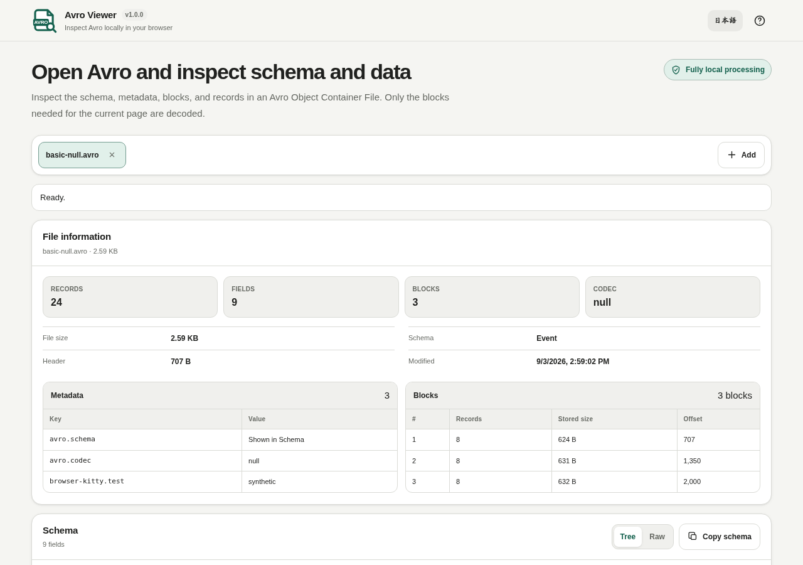

# Avro Viewer

The header uses EN / JA language targets with localized accessible names and Help titles; the version follows vMAJOR.MINOR.PATCH. The local-processing badge remains 完全ローカル処理 / Fully local processing.

[](https://github.com/ttomohisa/htmlapps-avro-viewer/actions/workflows/deploy-pages.yml)
[](LICENSE)
[](https://ttomohisa.github.io/htmlapps-avro-viewer/)

[日本語版 README](README.ja.md)

A privacy-focused, single-HTML viewer for opening Apache Avro Object Container Files and inspecting schema, metadata, block layout, logical types, and records without uploading selected files to a server.

Dialog contents remain scrollable in short or zoomed windows, and the background page stays still while a dialog is open.

## 🚀 Live demo

### [Open Avro Viewer on GitHub Pages](https://ttomohisa.github.io/htmlapps-avro-viewer/)

GitHub Pages delivers the initial HTML. After it loads, selected files are read and processed locally on your device. The app does not upload the file contents.

[](https://ttomohisa.github.io/htmlapps-avro-viewer/)

## Features

- **Inspect Avro container structure** — Read the embedded schema, file metadata, codec, record count, and block layout.
- **Review schema as Tree or Raw JSON** — Expand or collapse nested record, array, map, and union branches individually or together. Each open file remembers its expansion state. Recursive named references appear as finite labeled leaves; Raw JSON and Copy schema retain the complete schema.
- **Decode only the blocks you need** — Load blocks overlapping the current page instead of materializing the entire file at once.
- **Understand common logical types** — Render common date, timestamp, time-millis, and decimal values in a readable form. Declared decimal columns sort by exact numeric value on the current page, including nullable decimals and named fixed types, while preserving display/CSV text, stable ties, and nulls last in both directions. Strings retain text order; unions with multiple non-null branches retain the existing comparison because decoded values do not keep branch identity.
- **Handle common Avro codecs** — Support `null`, `deflate`, and `snappy`; try `zstandard` when the browser exposes a compatible decoder.
- **Inspect and export current-page data** — Use Table / Record views, visible-column selection, sorting, Cell Inspector, and CSV copy/save. Byte previews remain compact in tables; CSV, expanded records, and Cell Inspector / Copy value retain every byte in spaced hexadecimal, including nested `bytes` and `fixed` values. Record fields named `__value` work normally.
- **Work with multiple files safely** — A broken file does not stop the remaining files, and each tab keeps its own status, schema, metadata, blocks, and data.

## Quick start

### Use the web demo

Just [open the demo](https://ttomohisa.github.io/htmlapps-avro-viewer/). No installation or account is required.

### Use the standalone HTML

1. Download [`dist/index.html`](https://github.com/ttomohisa/htmlapps-avro-viewer/blob/main/dist/index.html) from this repository.
2. Open it directly in a current Chromium-based browser, Firefox, or Safari.

The repository also includes `dist/index.self-extract.html`, a self-extracting single-HTML variant that restores the readable standalone HTML in the browser before the app starts.

### Build it locally

1. Download or clone this repository.
2. Double-click `build-standalone.bat` on Windows.
3. The build generates and verifies `dist/index.html` and `dist/index.self-extract.html`.
4. Open either generated file directly from your device.

Python, Node.js, and a local web server are not required. The builder uses Windows PowerShell and the built-in `tar.exe`.

## Usage

1. Add one or more `.avro` Object Container Files.
2. Review record count, codec, block count, file size, and custom metadata.
3. Inspect the embedded schema as Tree or Raw JSON. Use the branch arrows or Expand all / Collapse all to focus on the relevant fields; Copy schema copies the original embedded schema text.
4. Browse records with the paging controls. Only blocks needed for the current page are decoded.
5. Switch between Table and Record views, then open Cell Inspector for full nested values when needed.
6. Copy or save the current page as CSV.

## Publish with GitHub Pages

The repository includes a workflow that builds the standalone HTML and deploys `dist/` to GitHub Pages automatically.

1. Push the repository to GitHub as `htmlapps-avro-viewer`.
2. Open **Settings → Pages → Build and deployment → Source** and select **GitHub Actions**.
3. Push to `main`, or manually run **Deploy standalone app to GitHub Pages** from the Actions tab.
4. After a successful deployment, the demo is available at `https://ttomohisa.github.io/htmlapps-avro-viewer/`.

Each push to `main` runs the repository checks, rebuilds the standalone files, and publishes the verified `dist/` output when GitHub Pages is enabled.

## Development and build layout

```text
.
├─ src/index.template.html       # Application template
├─ app.config.json               # App metadata, version, and build settings
├─ dependencies.json             # Runtime dependency declarations
├─ dependencies.lock.json        # Dependency lock metadata
├─ build-standalone.bat          # Windows build entry point
├─ build-standalone.ps1          # Standalone HTML builder
├─ scripts/check-repository.ps1  # Repository/build verification
├─ dist/index.html               # Readable single-HTML artifact
├─ dist/index.self-extract.html  # Self-extracting single-HTML artifact
└─ .github/workflows/
   ├─ build-standalone.yml       # Build validation
   └─ deploy-pages.yml           # Automatic GitHub Pages deployment
```

### Build and verify

```bat
build-standalone.bat
```

Repository checks can also be run directly:

The repository check requires Node.js 24 or later and exercises tiny synthetic Avro fixtures for complete values/exports, recursive schemas, native disclosure structure, per-file expansion state, language/view switches, and original schema copying against source, readable HTML, the decoded self-extract payload, and `avro-viewer.html`. After changing source, rebuild and refresh the tracked alias with `Copy-Item dist/index.html avro-viewer.html`, then run the repository check. These are source-level tests; browser interactions still need separate verification.

```powershell
powershell.exe -NoLogo -NoProfile -ExecutionPolicy Bypass -File .\scripts\check-repository.ps1
```

The build/verification flow checks the dependency lock, generates the standalone artifacts, verifies unresolved placeholders and runtime-network restrictions, and builds/verifies the self-extracting variant.

## Privacy and runtime network protection

The generated standalone HTML includes a Content Security Policy with `connect-src 'none'`. Selected files are read through browser file APIs and stay on the device. The app does not require analytics, telemetry, an external API, or a runtime CDN.

The GitHub Pages version requires one initial request to load the HTML. After that, the files you select are processed locally by the app. For use with the network completely disconnected, open `dist/index.html` directly.

Apache Avro is an Apache Software Foundation project. This viewer implements parts of the public Avro container/binary specification and is not affiliated with or endorsed by the Apache Software Foundation.

## Limitations

- Read-only: Avro files are not edited or rewritten.
- Raw Avro binary without an Object Container File header is not supported.
- RPC payload inspection is outside the current scope.
- CSV export covers the current page, not the whole file.
- `zstandard` availability depends on browser capabilities.

## Dependencies

Avro Viewer v1.0.1 does not bundle third-party runtime JavaScript libraries.

See [THIRD_PARTY_NOTICES.md](THIRD_PARTY_NOTICES.md) for format/project notices.

## Contributing

Bug reports and feature proposals are welcome through GitHub Issues. See [CONTRIBUTING.md](CONTRIBUTING.md) for development guidance.

## License

Copyright © 2026 ttomohisa

Licensed under the [MIT License](LICENSE).
